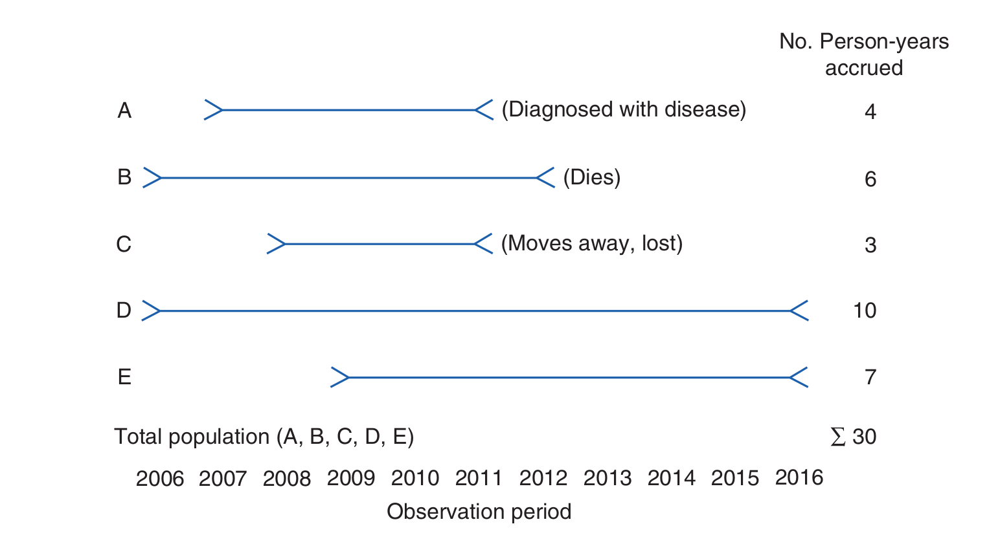

In episode 1 we defined the disease frequency of a population as some measure of how often a disease occurs in that population. There are many ways one can define this measure, and for any given case our choice will depend on the data at hand, the hypothesis of the study, or prevailing conventions in the  epidemiology literature. In this section we will look at some of the ways in which such a measure could be defined, and how to calculate it from a data set. Estimating the disease frequency, using some chosen measure of this frequency, for a given population is one of the first steps in analysing the pattern of disease in the population, working out determinants, and in planning effective control strategies. 

To estimate the frequency of a disease in a population, epidemiologists must:
1. develop a concrete definition of the disease,
2. count the number of people affected by the disease,
3. determine the size of the population from which the disease cases arose,
4. and account for the passage of time. 

We will now look at these steps in more detail.

# How do we determine who has a disease?
As the list of steps above suggests, we first need a definition of the disease in question, and a definition of the population. These definitions need to be concrete so that we can successfully count both the members of the population, and count those members whom are affected by the disease. 

> ## Definition: epidemiology
> **Epidemiology** is the study of the distribution and determinants of the frequency of health-related states in specified populations, and the application of this study to the control of health problems.
{: .prereq}

Recall that, in episode 1, we defined a population as a group of people with one or more shared characteristics. By choosing a characteristic, for example age, we can define a specific population that we will then study. Note that we are taking about two definitions here, the definition of a *general* population, which is a statement about what properties *any* population must have, and the definition of a *specific* population, which gives concrete example of a general population. For example, a specific population follows from the definition: the set of all citizens of Kenya. 

Location of residence, such as a country, state, city, or neighbourhood, is one of the most common ways to define a population. For example, the
people who reside in: the Woodstock suburb of Cape Town, South Africa; the city of Kumasi, Ghana; the state of Lagos, Nigeria; and the country of Tanzania are members of distinct populations defined by geopolitical entities ranging in size from a neighbourhood to an entire country. Residence near natural geographic features, such as rivers, mountains, lakes, or islands, can also be used to define a population. For example, people who live along the 2,574km length of the Zambezi River, around Kilimanjaro in Tanzania, and on the island of Madagascar are members of populations defined by geographic formations. 

Because epidemiology focuses on disease occurrence, populations are commonly defined in relation to a medical facility, such as a medical
professional’s office, clinic, or hospital. The service population of a medical facility (also called **catchment population**) consists of the people who use the facility’s services. This population is often difficult to define because an individual’s decision to use a facility may depend on how far it is from home, the person’s particular medical condition, and so forth.

The population is the set of all people of interest *who could potentially contract the disease*. For example, in a study of cervical cancer it would not be sensible to include men in the study population because we already know precisely the factor that protects men from cervical cancer, namely they do not have a cervix. It is helpful to focus on what is *not known before the study begins*, in this case, why some women in a population may contract the disease and others do not. The definition of a study population in each study is therefore closely related to the investigators' initial scientific question. In the above example, this question would be: why do some women contract cervical cancer and others do not? We may also restrict our attention to a specific population for means of study convenience; it may only be practical to consider the population of women living on the banks of the Zambezi river because the study was initiated in response to a particular health crisis there. The study question would in this case be: why do some women living next to the Zambezi river contract cervical cancer and others do not?

The definition of a disease is usually based on a combination of physical and pathological examinations, diagnostic test results, and signs
and symptoms. Which and how many criteria are used to define a “case” (a person who meets the disease definition) has important implications
for accurately determining who has the disease. Consider the various criteria that can be used to define a heart attack case. One could use the symptoms of chest pain; the results of diagnostic tests, such as electrocardiograms; or blood enzyme tests for cardiac damage. What are the implications of using only chest pain to define heart attack  cases? Using only this nonspecific symptom will capture most but not all people who have heart attacks because it will miss people who have “silent” heart attacks, which occur without chest pain. In addition, it will erroneously include many people who have other conditions that produce chest pain, such as indigestion.

A definition that includes more specific criteria, such as the results of diagnostic tests, will be more accurate. For example, if positive blood enzyme tests are included, silent heart attacks are likely to be picked up and the other conditions that cause chest pain omitted. In practice, epidemiologists use all available information from physical and pathological examinations and laboratory and other tests to define a case of a disease as accurately as possible.

> ## Challenge
> Why is it good practice to include the definition of the disease in the study report?
> > ## Solution
> > Publicly accepted definitions of diseases are likely to change over time, as new information is found or public perceptions change. It is important that investigators are clear on the precise definition used in the study, so that readers of the report in the future may understand exactly what was shown.
> {: .solution}
{: .challenge}

# Incidence
**Incidence** is defined as the occurrence of new cases of disease that develop in a candidate population over a specified time period. There are two important measures of incidence: cumulative incidence and incidence rate. Both measures are closely related but in a given context one can be more useful than the other. 

**Cumulative incidence** is defined as the proportion of a candidate population that becomes diseased over a specified period of time. Mathematically, it is expressed as follows.
> ## Cumulative incidence
>Let $$P$$ be a population with $$n$$ members. Consider a fixed time period, $$t$$, and let $$m$$ be the number of new cases (members of $$P$$ who contract the disease) over the time period $$t$$. The **cumulative incidence** of the disease for the population $$P$$ over the time period $$t$$ is:
>
>$$c := \frac{m}{n}$${: font-size: 120%; text-align: center;"}
{: .callout}

By convention, if a member of $$P$$ contracts the disease more than once over the specified time period, then only the first case is counted, and therefore $$c$$ may only take values between 0 and 1. For this reason it is often quoted as a percentage, namely taking values between 0% and 100%. It is clear from the definition that $$c$$ is always a dimensionless value. 

> ## Example
> As an example, consider the population of a small imaginary town with 10000 residents. Imagine that, for an influenza study, investigators monitor the residents of this town for a year, from June 1st 2021 till June 1st 2022. Over this time period, say that a flu outbreak occurs just after June 1st 2021, and continues to spread. Let us say that, by June 1st, 2123 residents of the town have contracted the flu once, and no resident was affected twice in the time period. Then, using the above definition, we may deduce for our example that $$P$$ is the set of residents of the town and so $$n=10000$$, $$t$$ is June 1st 2021 till June 1st 2022, and the number of cases $$m=2123$$. Therefore the cumulative incidence $$c$$ of flu on the residents of the town for the time period of the study is: $$c = 2123 / 10000 = 0.2123$$.
{: .example}

Note that this definition of $$c$$ depends on the time period as well as the population and the disease definition used. For example, we may define a case as a person showing flu-like symptoms, or we may be more accurate and test each person for the presence of a specific antibody. Changes in any of these factors will result in changes to the final value of $$c$$.

**Incidence rate** is defined as the occurrence of new cases of disease that arise during person-time of observation. Before we can define the incidence rate mathematically, we need to clarify what we mean by person time, which can be a confusing concept. 
> ## Person time
>Let $$P$$ be a population, with $$x$$ any member of $$P$$. Consider a study whereby person $$x$$ is followed for a fixed time period $$t$$ that has a duration $$|t|$$. Then, the **person-time** that has been accrued in this study by following $$x$$ over the time period $$t$$ is:
>
>$$p := |t|$${: font-size: 120%; text-align: center;"}
{: .callout}

Person-time is *additive*, in the sense that the person-time of two individuals in a study is the sum of the two individual person-times. In addition, we may stop following an individual in a study for one of three reasons:
1. the person contracts the disease (becomes a case),
2. the person dies,
3. or the person is lost to follow-up.

In either of these cases, the time period $$t$$ ends for that person and the person-time is computed as the duration between the beginning of the study and this endpoint. 

Consider this example. A small study follows a group of 4 people, A, B, C and D, for a period of 5 years. The disease under investigation is Malaria. The study begins on 3rd December 2020 and ends 3rd December 2025. During this time, person A contracts malaria on the 2nd January 2022; person B survives the time period without contracting malaria; person C dies from an unrelated cause on 24th March 2024 and person D moves away from the study catchment area, and is no longer contactable, on 14th of February 2023. The person-time of A, $$p_A$$, is $$395 days$$; the person-time of B, $$p_B$$, is $$1826 days$$; the person-time of C, $$p_C$$, is $$1207 days$$; and the person time of D, $$p_D$$, is $$803 days$$. Since person-time is additive, the total person-time of the study is $$p_A + p_B + p_C + p_D = (395 + 1826 + 1207 + 803) days = 4231 days$$.

Note that the units of person-time is time. In the above example we chose days but this could be weeks, months, years e.t.c.

This idea of person-time is illustrated below for a related (but different!) example.

We may now define the incidence rate. Mathematically, the incidence rate is expressed as follows.
> ## Incidence rate
> Let $$P$$ be a study population. Let $$p$$ be the person-time of the study, and let $$m$$ be the number of new cases of the disease recorded in the population (repeated cases are not counted). Then the incidence rate of the study is:
>
>$$i := \frac{m}{p}$${: font-size: 120%; text-align: center;"}
{: .callout}

To continue the above malaria example, we see that only person A actually contracted malaria. Therefore, we have that $$m=1$$ and as we previously calculated, $$p = p_A + p_B + p_C + p_D = 4231 days$$, which means the incidence rate $$i$$ is $$\frac{1}{4231 days}$$.

From this example we see that the units of incidence rate is 1/time. 

> ## Challenge
> What assumption is being made by the cumulative frequency measure about the study population that is not made by the incidence rate measure?
> > ## Solution
> > The incidence rate is clearly a more accurate measure of the disease frequency than the cumulative incidence, since the cumulative incidence is based on the assumption that *all study participants are followed for the entire study duration*, which is usually not the case in practice. The incidence rate does not use this assumption. 
> {: .solution}
{: .challenge}

# Prevalence
Whereas incidence measures the frequency with which new disease develops, **prevalence** measures the frequency of existing disease. It is simply defined as the proportion of the total population that is diseased. There are two types of prevalence measures—point prevalence and period prevalence—that relate prevalence to different amounts of time. **Point prevalence** refers to the proportion of the population that is diseased at a single point in time and can be thought of as a single snapshot of the population. The point can be either a particular calendar date such as July 1, 2017, or a point in someone’s life, such as college graduation. **Period prevalence** refers to the proportion of the population that is diseased during a specified duration of time, such as during the year 2017. The period prevalence includes the number of cases that were present at any time over the course of the year.

Mathematically, these two measures of prevalence are defined as follows.
> ## point prevalence
> Let $$P$$ be a population, with number of members $$n$$. Let $$t$$ be a single point in time, and let the total number of disease cases in $$P$$ at $$t$$ be $$m$$. Then, the point prevalence of the disease in the population $$P$$ at the time $$t$$ is given by:
>
> $$\frac{m}{n}$${: font-size: 120%; text-align: center;"}
{: .callout}

> ## point prevalence
> Let $$P$$ be a population, with number of members $$n$$. Let $$t$$ be a period of time, and let the total number of disease cases in $$P$$ during $$t$$ be $$m$$. Then, the point prevalence of the disease in the population $$P$$ at the time $$t$$ is given by:
>
> $$\frac{m}{n}$${: font-size: 120%; text-align: center;"}
{: .callout}

Let’s use these formulas to calculate the point and period prevalence of pneumonia in a nursing home population. The point and period of interest are July 1, 2017, and January 1 through December 31, 2017, respectively. On July 1, 2017, there were $$m=5$$ cases of pneumonia among the $$n=500$$ nursing home residents. Thus, the point prevalence of pneumonia was 5/500, or 1%, on that date. During the period January 1 through December 31, 2017, there were 45 cases of pneumonia among the 500 nursing home residents; therefore, the period prevalence was 45/500, or 9%, during the year. Note that, in this example, the size of the nursing home population remained stable over the year, but if it had gained or lost members, the average size of the nursing home population during 2017 would have been the appropriate denominator for the period prevalence measure.

Epidemiologists and other public health professionals use each measure of disease frequency for specific purposes. Incidence is
most useful for evaluating the effectiveness of programs that try to prevent disease from occurring in the first place. In addition, researchers
who study the causes of disease prefer to study new cases (incidence) over existing ones (prevalence) because they are usually interested in exposures that lead to developing the disease. Prevalence obscures causal relationships *because it combines incidence and survival*. In addition,
many researchers prefer to use incidence because the timing of exposures in relation to disease occurrence can be determined more accurately.

On the other hand, prevalence is useful for estimating the needs of medical facilities and allocating resources for treating people who already have a disease. In addition, researchers who study diseases such as birth defects (wherein it is difficult to gather information on defects present in miscarried and aborted fetuses) and chronic conditions such as arthritis (whose beginnings are difficult to pinpoint) have no choice but to use prevalence. Unfortunately, results of such studies are difficult to interpret because it is unclear how much the association is influenced by using a group of survivors.

## References

[^1]: Ann Aschengrau and George R. Seage III, Essentials of epidemiology in public health, Fourth edition (2020, Jones & Bartlett Learning)