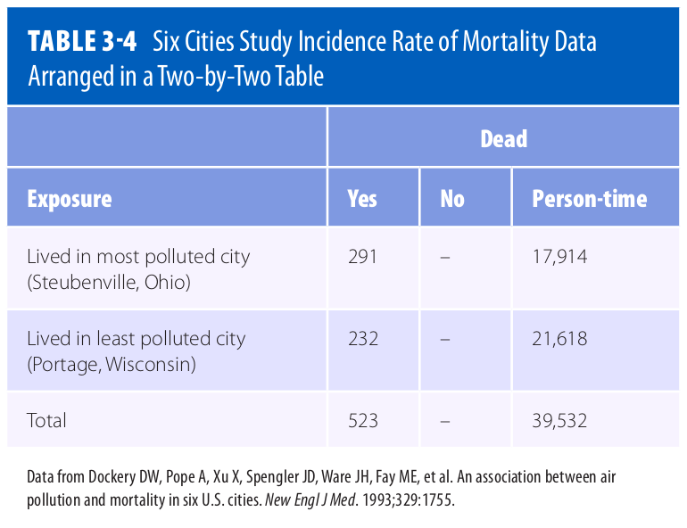

Introduction
---
Measures of disease frequency are the building blocks epidemiologists use to assess the effects of a disease on a population. 
Comparisons of measures of disease frequency allows for meaningful groupings that allow one to describe the relationship between a characteristic and a disease and to assess the public health effect of the exposure. Disease frequencies can be compared between different populations or between subgroups within a population. For example, one might be interested in comparing disease frequencies between residents in Tanzania and Ghana or between subgroups of sickle cell patients within Nigeria according to haematological characteristics, such as HbF level , MCHC, or Hb level.
Usually, people who have a particular characteristic such as high foetal haemoglobin (HbF) level are compared with those who do not share the charateristic. This characteristic is often called the **exposure** and those who have the characteristic form the **exposed** or the **index group** while those without the characteristic form the **unexposed** or **referent group**. In instances in which no group is clearly unexposed, for instance a group of SCD patients who have higher than normal HbF level, the group with the lowest exposure e.g. lowest HbF level is typically used as the unexposed group.

> ## Example
> To test the hypothesis that HbF is associated with increased survival of SCD patients, one could compare the level of HbF among adult SCD patients (exposed group) to that of adults without SCD (unexposed group).
{: .callout}

# Data Organizations
---
To compare disease frequencies, epidemiologists first organize the data in a “two-by-two” or “fourfold” table, so called because data are cross tabulated by two categories of exposure (yes or no) and two categories of disease (yes or no) (Table 1). These tables can be used in a study comparing proportions, such as prevalence or cumulative incidence.

**Table 1**: General Organization of Cumulative Incidence or Prevalence Data in a Two-by-Two Table

 *Adapted from* [^1]

The outermost row and column numbers are called the margins of the table (e.g., a + b), and the numbers in the inner area are called the cells (a, b, c, d). Some epidemiologists may prefere to arrange the table with exposure across the top and disease status to the side. In such a case, one must be careful to also make appopriate changes to the formulas.

## Measures of Comparison
Measures of disease frequency can be compared in two ways. They can be subtracted from one another or divided by one another. The subtracted measures of disease frequency are termed **absolute comparisons**, and the divided ones are known as **relative comparisons**. Absolute comparisons generally give information about the **public health impact of an exposure**, and relative comparisons generally give information about the **strength of the relationship between an exposure and a disease**.

### A) Absolute Measures of Comparison

A general term for this comparison is the **risk difference** or **rate difference**. More precise terms based on the measure of disease frequency used for the calculation include **incidence rate difference**, **cumulative incidence difference**, and **prevalence difference**. Absolute comparisons can be calculated for either exposed individuals or the total population. When exposed individuals are the focus, the absolute difference measure is calculated as follows:

$$RD=R_e - R_u$$

where $$RD$$ is the rate or risk difference, $$R_e$$ is the rate or risk in the exposed group (for instance the mortality rate in individuals with SCD), and $$R_u$$ is the rate or risk in the unexposed group (for instance the mortality rate in normal individuals). Refer to [measures of disease frequency]({{ page.root }}) for more on rates.
 
The $$RD$$ describes the **disease burden associated with exposure among exposed people**. Or simply put, it is the **excess risk or rate of disease or outcome associated with the exposure**.

---
> ## Question
> Considering our example of mortality rate in SCD versus normal individuals, what would $$RD$$ be?
> > ## Answer
> > Excess mortality
> {: .solution}
{: .challenge}
---

Assuming that the exposure is a direct cause of the disease, then $$RD$$ can be used to calculate the number of disease cases that would be eliminated if the exposure were eliminated (or reduced to the level of the unexposed group). For instance, consider the data presented in Table 3.4 of [^1].

 *Adapted from* [^1]

To calculate the mortality:

$$Incidence\ rate\ of\ mortality_{in\ Steubenville} = \frac{291}{17,914}$$

$$==> \frac{16.24}{1,000}(person-years)$$

$$Incidence\ rate\ of\ mortality_{in\ Portage} = \frac{232}{21,618}$$

$$==> \frac{10.73}{1,000}(person-years)$$

--------------

$$Incident\ rate\ difference = IR_{most\ polluted\ city} - IR_{least\ polluted\ city}$$

$$IRD = \frac{16.24}{1,000}(person-years) - \frac{10.73}{1,000}(person-years)$$

$$IRD = \frac{5.51}{1,000}(person-years)$$

Interpreted narrowly, there are 5.51 excess deaths per 1,000 person-years among Steubenville residents. Or, more broadly, if pollution caused the deaths, then 5.51 deaths among Steubenville residents for every 1,000 person-years of observation would be eliminated if the pollution level were reduced to that of Portage. To obtain the actual number of excess cases, simply multiply the excess risk or rate by the number of exposed people. Given that a population usually consists of both exposed and unexposed people, it is therefore useful to know the impact of the exposure not only on the exposed, but also on the unexposed group, hence the total population. **Population risk difference** is the term used to describe this comparison, and is calculated as follows:

$$PRD = R_t - R_u$$

where $$PRD$$ is the population rate/risk difference, $$R_t$$ is the rate or risk in the total population, and $$R_u$$ is the rate or risk in the unexposed group.

It is also possible to obtain the population rate difference by multiplying the risk or rate difference ($$RD$$) by the proportion of the population that is exposed ($$P_e$$ ):

$$PRD = RD\ ×\ P_e$$

where $$P_e$$ is the proportion of the population that is exposed. The $$PRD$$ describes the excess number of cases in the total population that is associated with the exposure. Like $$IRD$$, $$PRD$$ dentifies the number of cases of disease that would be eliminated in the total population if the exposure were eliminated (or reduced to the level in the unexposed group).

One can see from the formulas that, unless everyone in the population is exposed, the impact of the exposure is always smaller in the total population than in the exposed group and therefore the $$PRD$$ is always smaller than the $$RD$$. The units and range of the absolute measures of comparison ($$RD$$ and $$PRD$$) depend on the measure of disease frequency that is used for the calculation. For example, if incidence rates are used, then the measure will have person-time units and can range from negative infinity to positive infinity. On the other hand, if one uses cumulative incidence or prevalence, the measure is dimensionless and can range from −1 to +1.

Two parallel measures of comparison that express the public health impact of an exposure as proportions are the attributable proportion among the exposed (also called the **etiologic fraction**) and the
attributable proportion among the total population. The **attributable proportion among the exposed ($$AP_e$$)** describes the proportion of disease among the exposed that would be eliminated if the exposure were eliminated. It assumes a causal relationship between the exposure and disease. Mathematically, it is expressed as follows:

$$AP_e = [\frac{(R_e - R_u)}{R_e}]\ ×\ 100$$ 

The **attributable proportion among the total population ($$AP_t$$)** describes the proportion of disease among the total population that would be eliminated if the exposure were eliminated. It is expressed as follows:

$$AP_t = [\frac{(R_t - R_u)}{R_t}]\ ×\ 100$$ 

The attributable proportion among the total population is very useful for determining priorities for public health action.

The attributable proportion is used when an exposure is considered a cause of the disease. When an exposure is thought to protect against the disease, the prevented fraction ($$PF$$) can be calculated according to the following formula:

$$PF = [\frac{(R_u - R_e)}{R_u}]\ ×\ 100$$

---
> ## Question: Select the correct option
> Two parallel measures of comparison that express the public health impact of exposure as proportions include
> > ## Options
> > * (A) attributable fraction among the unexposed and etiologic fraction
> > * (B) attributable proportion among the unexposed and etiologic proportion
> > * (C) attributable fraction among the exposed and etiologic fraction
> > * (D) attributable proportion among the total population and etiologic proportion
> {: .challenge}
> > ## Answer
> > * [ ] attributable fraction among the unexposed and etiologic fraction
> > * [ ] attributable proportion among the unexposed and etiologic proportion
> > * [ ] attributable fraction among the exposed and etiologic fraction
> > * [x] attributable proportion among the total population and etiologic proportion **(D)**
> {: .solution}
{: .challenge}
---

### B) Relative Measures of Comparison
A relative measure of comparison is based on the ratio of two measures of disease frequency. This measure is generally called the **risk ratio**, **rate ratio**, **relative rate**, or **relative risk**. More precise terms that are based on the measure of disease frequency used for the calculation include incidence rate ratio, cumulative incidence ratio, and prevalence ratio. Mathematically, the relative measure is expressed as follows:

$$RR = \frac{R_e}{R_u}$$

where $$RR$$ is the rate or risk ratio or relative risk; $$R_e$$ is the incidence rate, cumulative incidence, or prevalence in the exposed group; and $$R_u$$ is the incidence rate, cumulative incidence, or prevalence in the unexposed group. This measure gives information about the strength of the relationship between the exposure and disease and is most useful in etiological studies.

Consider the example in Table 3.4 above:

$$RR = \frac{\frac{16.24}{1,000}(person-years)}{\frac{10.73}{1,000}(person-years)} = 1.51$$

This means that, compared with the residents of Portage, there is a 1.51-fold increased rate of death among residents of Steubenville. Another interpretation is that the death rate in Steubenville is 1.51 times that of Portage.

Another way to express this information is in terms of the **excess relative rate**, which is
mathematically equal to:

$$(RR - 1) × 100$$

---
> ## Problem
> > 1. Using the previous example in which $$RR = 1.51$$, calculate the excess relative rate. What does the value mean?
> > 2. Assuming that the relative risk of renal complication in SCD individuals with the 3.7 kb alpha-thalassemia deletion as compared to SCD individuals without the mutation is 0.20, calculate the excess relative risk. Explain the meaning of the value.
> {: .challenge}
> > ## Solution
> > 1. Excess $$RR = (1.51 - 1) × 100 = 51\%.$$ This means that compared with the residents of Portage, the residents of Steubenville have a 51% increased rate of death.
> > 2. Excess $$RR = (1 - 0.20) × 100 = 80\%.$$ This means that compared with SCD individuals who lack the 3.7 kb alpha-thalassemia deletion, SCD individuals with the mutation have an 80% reduced risk of renal complications.
> {: .solution}
{: .challenge}
----

Most epidemiologists prefer to use the relative method of comparison for etiologic research because it indicates how many times higher or lower the disease risk is among the exposed as compared with the baseline risk among the unexposed.

### Direct Standardization
Crude rates are summary measures of disease frequency that are based on the raw data. For example, a crude prevalence is calculated by dividing the total number of cases in the population by the total number of indi viduals in that population at a point in time (point prevalence) or during a period of time (period prevalence). It is difficult to interpret absolute and relative measures of comparison that are based on crude rates when the compared groups differ on a characteristic that affects the rate of disease (such as age, gender, or race). This difference between the groups may result in an unfair comparison and distort the results 

Calculation characteristic-specific comparisons such as comparisons among exposed and unexposed individuals of a particular age (age-specific comparison) should give a more accurate picture of rates. However, because there are usually many age groups to examine, this method results in a cumbersome number of comparisons. Furthermore, comparing age-specific rates can give a confusing picture if some of the rates are higher in one state and some are higher in the other. Epidemiologists commonly
use an alternative method in which the rates in each state are summarized in a single number that adjusts for the age differences between the populations. These summary rates, which are known as age-standardized or age-adjusted rates, answer the question, “What would the death rate be
in each state if the populations had identical age distributions?” The two methods for calculating age-standardized rates are known as direct and indirect methods of standardization.

**i) Direct method:**

The direct method requires the following information:
1. age-specific rates in each group.
2. age structure of a “standard” population.

Age-standardized rates are weighted averages of the age-specific rates, with the weights equal to the proportion of the standard population in each age category.

---
> ## Quiz
> > 1. State one example of an absolute measure of comparison in the context of SCD
> > 2. What does a relative risk ($$RR$$) value of 1.0 mean?
> > 3. Why is it important to standadize data before calculating measures of comparison?
> {: .challenge}
> > ## Solutions
> > 1. Excess mortality
> > 2. A relative risk of 1.0 means there is no relationship between the exposure and disease.
> > 3. Measures of comparison calculated on crude rates when the compared groups differ on a characteristic that affects the rate could be inaccurate.
> {: .solution}
{: .challenge}
---

## References

[^1]: Ann Aschengrau and George R. Seage III, Essentials of epidemiology in public health, Fourth edition (2020, Jones & Bartlett Learning)
