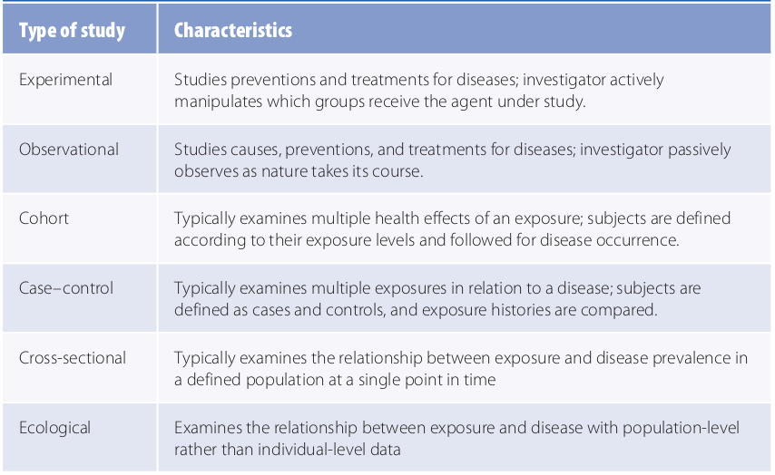

## Introduction
The goal of epidemiological research is to harvest valid and precise information about the causes, preventions, and treatments for disease.
There are several types of study designs in emidemiological research, including experimental studies and observational studies such as cohort and case-control studies.
Each study design represents a different way of harvesting information. 
The selection of one design over another depends on the particular research question, concerns about validity and efficiency, and practical and ethical considerations.

### Study types
---

 *Adapted from* [^1]

---
**A. Experimental studies**

Also known as trials
  - Investigate the role of some agent in the prevention or treatment of a disease.
  - Usually involves two groups: the **treatment group** to which the investigator allocates the agent, and the **comparison group** which is not allocated the agent.
  - The **comparison group** may receive no therapeutic agent at all, an inactive agent such as a **placebo**, or another active agent.
  - **Selection of study population** depends on purpose of the trial as well as scientific, safety, and practical considerations.
  - **Consent** to participat in a trial is a critical step that must be fulfilled. The procedure for obtaining **_informed consent_** will be discussed in another episode.
  - It is important that the treatment and comparison groups are closely monitored for the study outcome and other effecrs during the **follow-up** stage of the study.
  - Analysis approach is known as intent-to-treat or treatment assignment analysis. An alternative approach involves efficacy analysis.
  - Notable examples of hydroxyurea therapy for SCD include the REACH[^2] and NOHARM[^3] trials in Africa, and the BABY-HUG[^4] and HUSOFT[^5] trials in the USA.

   > ## Selection of study population: examples
   >	Prevention trials --> healthy or high-risk individuals
   >	Therapeutic trials --> individuals with specific diseases (e.g. hydroxyurea therapy in SCD)
   {: .callout}

   > ## Question: Select the correct option.
   > In a trial, the investigator manipulates a therapeutic agent in the
   > > - (A) agent group
   > > - (B) comparison group
   > > - (C) population group
   > > - (D) treament group
   > {: .challenge}
   > > ## Answer
   > > - [ ] agent group
   > > - [ ] comparison group
   > > - [ ] population group
   > > - [x] treament group
   > {: .solution}
   {: .challenge}
---

**B. Observational studies**

Considered "natural" because the investigator lets nature take its course. There are two major types.
1. **Cohort studies**: 
   - A **cohort** is a group of people with a common characteristic or experience.
   - Healthy subjects are **exposed** to a factor and followed over time to determine the incidence of symptoms, disease, or death.
   - Two groups are usually involved, the exposed group, and the **unexposed** group referred to as the reference, referent, or comparison group.
   - Other expressions of cohort studies include **follow-up**, **incidence**, or **longitudinal study**.
   - The occurrence of the outcome is usually measured using cumulative incidence or **incidence rates**.
   - The relationship between the exposure and outcome is quantified using absolute or **relative risks**.
   
&nbsp;

   ***Timing of cohort studies***
   - **Prospective cohort studies** group participants based on past or current exposure and follow into the future for outcomes.
   - In **Retrospective cohort studies**, both exposure  and outcome have already occurred.
   - **Ambidirectional cohort study**: Has both prospective and retrospective components.
   
&nbsp;

---

2. **Case-control studies**: 
   - These are similar to cohort studies. However, participants are selected based on outcome (disease) rather than exposure.
   - An individual with the disease is called a **case** while an individual without the disease is called a **control**.
   - Comparison between the case and control groups is made to determine the exposure histories.
   - The analysis approach involves the estimation of the **odds ratio** (OR) which provides an estimate of the disease relative risk.
   - An OR less than 1 means decreased disease risk or decreased susceptibility, an OR greater than 1 means increased disease risk or increased susceptibility, while an OR equall to 1 means no effect of the exposure on the outcome.

   > ## Study population selection 
   > - A critical aspect is the formulation of a disease or **case definition**.
   > - A case definition is usually based on a combination of signs and symptoms, physical and pathological examinations, and results of diagnostic tests.
   {: .callout}

   > ## Questions: Choose the correct option.
   > **Q1**. In a retrospective cohort study
   > > - (A) past and current exposures, as well as outcome are not known
   > > - (B) only outcome and future exposure are known
   > > - (C) exposure and outcome are known
   > > - (D) exposures are known but not outcome
   > {: .challenge}
   > **Q2**. In a case-control study, a highly protective locus is said to have
   > > - (A) OR << 1
   > > - (B) OR = 1
   > > - (C) OR < 1
   > > - (D) OR > 1
   > {: .challenge}
   > > ## Answers
   > > - Q1. C
   > >
   > > - Q2. A
   > {: .solution}
   {: .challenge}
---

**C. Cross-sectional studies**

   - Cross-sectional studies typically take a snapshot of a population at a single point in time and therefore usually measure the disease prevalence in relation to the exposure prevalence.
   - This is the most common study type carried out for public health planning and etiologic research by most governments and organizations.
   - Here, populations are commonly selected without regard to exposure or disease status.
   - Ascertainment of the time of sample collection (temporal) can allow for temporal comparisons.
   - When exposure is a changeable characteristic such as cigarette smoking, a simple measure of the exposure prevalence in relation to the disease prevalence is not sufficient to tell the temporal sequence, i.e. which one came first. 
   
&nbsp;

---
**D. Ecological studies**
   - Examine the rates of disease in relation to a factor described on a population level. i.e. unit of analysis are populations rather than individuals.
   - The population-level factor may be an aggregate measure such as age (proportion of individuals older than 40 years of age), or a biological measure such as level of foetal haemoglobin. 
   - Ecological studies usually identify groups by place, time, or a combination of the two.

   
&nbsp;

**_Decision tree for choosing among study designs_**

 *Adapted from* [^1]

> ## Quiz
> > 1. What is the hallmark that distinguishes experimental from observational studies?
> > 
> > 2. Name one example of a trial on SCD in Africa.
> >
> > 3. What is the treatment in this trial?
> >
> > 4. In a cross-sectional study, it is possible to tell whether exposure came before disease when exposure is not a changeable characteristic.
> - (A) True
> - (B) False
> {: .challenge}
> > ## Answers
> > > 1. Active manipulation of a therapeutic agent (treatment) by an investigator in experimental studies but not observational studies.
> > > 2. REACH/NOHARM trial
> > > 3. Hydroxyurea (HU)
> > > 4. (A) True
> >{: .challenge}
> > > ## Take home
> > > - Experimental study: active manipulation of a therapeutic agent by an investigator.
> > > - Observational study: nature takes its course.
> > > - Cross-sectional studies: most governmental public health surveys.
> > > - Ecological studies: think of meta-analyses where comparison is made among populations rather than individuals.
> > {: .solution}
> {: .solution}
{: .challenge}
---

**References**
---
[^1]: Ann Aschengrau and George R. Seage III, Essentials of epidemiology in public health, Fourth edition (2020, Jones & Bartlett Learning)

[^2]: McGann, P. T., Williams, T. N., Olupot-Olupot, P., Tomlinson, G. A., Lane, A., Luís Reis da Fonseca, J., Kitenge, R., Mochamah, G., Wabwire, H., Stuber, S., Howard, T. A., McElhinney, K., Aygun, B., Latham, T., Santos, B., Tshilolo, L., Ware, R. E., & REACH Investigators (2018). Realizing effectiveness across continents with hydroxyurea: Enrollment and baseline characteristics of the multicenter REACH study in Sub-Saharan Africa. *American journal of hematology*, **93**(4), 537–545. <a href="https://doi.org/10.1002/ajh.25034">https://doi.org/10.1002/ajh.25034</a>

[^3]: Opoka, R. O., Ndugwa, C. M., Latham, T. S., Lane, A., Hume, H. A., Kasirye, P., Hodges, J. S., Ware, R. E., & John, C. C. (2017). Novel use Of Hydroxyurea in an African Region with Malaria (NOHARM): a trial for children with sickle cell anemia. *Blood*, **130**(24), 2585–2593. [https://doi.org/10.1182/blood-2017-06-788935](https://doi.org/10.1182/blood-2017-06-788935)

[^4]: Wang, W. C., Ware, R. E., Miller, S. T., Iyer, R. V., Casella, J. F., Minniti, C. P., Rana, S., Thornburg, C. D., Rogers, Z. R., Kalpatthi, R. V., Barredo, J. C., Brown, R. C., Sarnaik, S. A., Howard, T. H., Wynn, L. W., Kutlar, A., Armstrong, F. D., Files, B. A., Goldsmith, J. C., Waclawiw, M. A., … BABY HUG investigators (2011). Hydroxycarbamide in very young children with sickle-cell anaemia: a multicentre, randomised, controlled trial (BABY HUG). *Lancet (London, England)*, **377**(9778), 1663–1672. [https://doi.org/10.1016/S0140-6736(11)60355-3](https://doi.org/10.1016/S0140-6736(11)60355-3)

[^5]: Hankins, J. S., Ware, R. E., Rogers, Z. R., Wynn, L. W., Lane, P. A., Scott, J. P., & Wang, W. C. (2005). Long-term hydroxyurea therapy for infants with sickle cell anemia: the HUSOFT extension study. *Blood*, **106**(7), 2269–2275. [https://doi.org/10.1182/Blood-2004-12-4973](https://doi.org/10.1182/Blood-2004-12-4973)