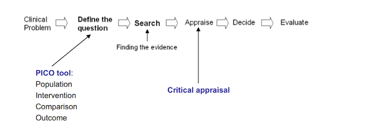
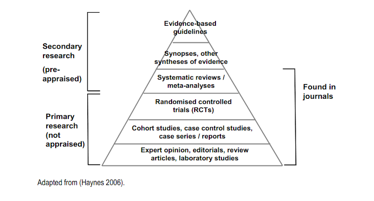

## The five step of critical appraisal are:

1. asking answerable questions, i.e. formulating questions into a format whereby you can interrogate the medical literature and hopefully find an answer-to do this, you may use the PICO tool, which helps to break down the query into **Population, Intervention, Comparison, Outcome**;

2. you then need to search for the evidence-if you can find a pre-appraised resource, you can miss out the next step;

3. the next step is critical appraisal of your results;

4. you then decide what action to take from your findings;

5. finally, you evaluate your new or amended practice

---

 

---

## Critical appraisal of different study designs
To critically appraise a journal article, you would have to start by assessing the research methods used in the study. This is done using checklists which are specific to the study design.

The following checklists are commonly used:
* [CASP](http://www.casp-uk.net/#!casp-tools-checklists/c18f8)
* [SIGN](guideline developer’s handbook http://www.sign.ac.uk/methodology/checklists.html)
* [CEBMH](http://www.cebm.net/critical-appraisal/)

---

 

---

### Critical appraisal of RCTs
Factors to look for:
1. allocation(randomisation, stratification, confounders);
2. blinding;
3. follow up of participants (intention to treat);
4. data collection (bias);
5. sample size (power calculation);
6. presentation of results (clear, precise);
7. applicability to local population

### Critical appraisal of systematic reviews
Factors to look for:
1. literature search (did it include published and unpublished materials as well asnon-English language studies? Was personal contact with experts sought?);
quality-control of studies included (type of study;scoring system used to rate studies;analysis performed by at least two experts);
2. homogeneity of studies;
3. presentation of results (clear, precise);
4. applicability to the local population.

### Critical appraisal of cohort studies
Factors to look for:

1. Were the two groups similar and recruited from the same population?
2. Were the exposures measured similarly to assign people to both exposed and unexposed groups?
3. Was the exposure measured in a valid and reliable way?
4. Were confounding factors identified?
5. Were strategies to deal with confounding factors stated?6.Were the groups/participants free of the outcome at the start of the study (or at the moment of exposure)?
6. Were the outcomes measured in a valid and reliable way?
7. Was the follow up time reported and sufficient to belong enough for outcomes to occur?
8. Was follow up complete, and if not, were the reasons to loss to follow up described and explored?
9. Were strategies to address incomplete follow up utilized?
10. Was appropriate statistical analysis used

### Critical appraisal of Case Control Studies 
Factors to look for:

1. Were the groups comparable other than the presence of disease in cases or the absence of disease in controls?
2. Were cases and controls matched appropriately?
3. Were the same criteria used for identification of cases and controls?
4. Was exposure measured in a standard, valid and reliable way?
5. Was exposure measured in the same way for cases and controls?
6. Were confounding factors identified? 
7. Were strategies to deal with confounding factors stated?
8. Were outcomes assessed in a standard, valid and reliable way for casesand controls?
9. Was the exposure period of interest long enough to be meaningful?
10. Was appropriate statistical analysis used?

### Critical Appraisal of a Cross-Sectional Study (Survey)
Factors to look for:

1. Did the study address a clearly focused question / issue?
2. Is the research method (study design) appropriate for answering the research question?
3. Is the method of selection of the subjects (employees, teams,divisions, organizations) clearly described?
4. Could the way the sample was obtained introduce(selection)bias?
5. Was the sample of subjects representative with regard to the population to which the findings will be referred?
6. Was the sample size based on pre-study considerations of statistical power?
7. Was a satisfactory response rate achieved?
8. Are the measurements (questionnaires) likely to be valid and reliable?
9. Was the statistical significance assessed?
10. Are confidence intervals given for the main results?
11. Could there be confounding factors that haven’t been accounted for?
12. Can the results be applied to your organization

